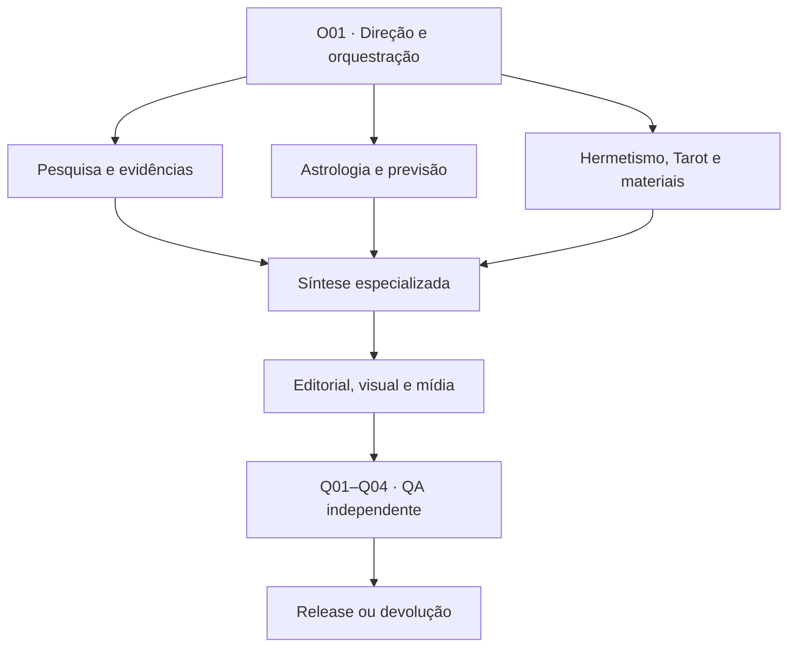

# Arquitetura do Laboratório Astrológico, Hermético, Preditivo e Editorial Multiagente

## Resposta técnica

**O número ótimo recomendado é 27 agentes lógicos.** Eles são apoiados por **18 motores determinísticos**, **10 bases versionadas**, **16 skills compartilhadas** e **13 gates de QA**. A análise pontuou 35 candidaturas, comparou 595 pares e documentou oito fusões. O conjunto ativo por produto fica entre 7 e 14 agentes; os 27 nunca devem ser acionados por reflexo.

Esse número não é uma declaração ontológica. É a menor arquitetura profissional encontrada nesta rodada que preserva: cálculo separado de interpretação; tradições segregadas; previsão separada de calibração; produção separada de auditoria; conteúdo separado de promessa comercial. Os motores não são “infalíveis”: devem ser **reprodutíveis, versionados, testados e fail-closed**.

O status correto é **arquitetura provisória v1**. O próprio comando-fonte proíbe congelar agentes definitivos antes da decomposição e das simulações. Nesta rodada foram usados seis auditores temporários; os 27 blueprints foram materializados, mas permanecem `DRAFT` até pilotos sintéticos A–H.

## Como o número emergiu

- Cerca de 120 atividades nomeadas foram consolidadas em 91 unidades funcionais.
- O filtro tipológico retirou cálculo, armazenamento, procedimento repetível e aprovação pura da disputa por “agente”.
- 35 papéis ultrapassaram o limiar indicativo de 38/50; a mediana foi 46/50.
- O teste par-a-par avaliou função (50%), fontes (15%), ferramentas (15%) e outputs (20%).
- Oito fusões reduziram 35 candidaturas para 27 papéis lógicos, preservando modos internos e QA externo.
- Ausência de volume, SLA e orçamento impede decidir quantos processos permanentes devem ficar “quentes”; isso não impede definir a arquitetura lógica.

### Fusões governadas

| Candidaturas | Agente final | Condição de validade |
|---|---|---|
| C01, C02 | O01 | mesmos contratos de arquitetura, decisão e escalada; uma fila operacional |
| C06, C34 | Q02 | verificação de evidências é revisão independente, não pesquisa produtora |
| C18, C21 | H01 | história e aplicação ritual segura compartilham corpus; gates impedem promessa |
| C22, C23 | T01 | modos histórico e aplicado; RNG permanece motor separado |
| C24, C25 | N01 | duas lanes internas factuais e simbólicas; frases nunca se misturam |
| C26, C27 | E01 | mesma saída canônica, claim lock e público; Q04 audita |
| C28, C29 | V01 | design e cartografia unificados por semântica; Q01/Q04 auditam |
| C31, C32 | M02 | estratégia e mensuração formam um ciclo; Q04 controla autoavaliação |

## Organograma funcional

Hierarquia operacional:

- Direção: O01.
- Pesquisa: R01–R02; verificação independente em Q02.
- Astrologia: A01–A09.
- Previsão: P01–P02.
- Hermetismo, Tarot e materiais: H01–H03, T01, N01.
- Editorial, visual, mídia e marketing: E01, V01, M01, M02.
- QA e release: Q01–Q04.

## Registro mestre dos agentes

| ID | Agente | Missão exclusiva | Por que independente | Inputs | Outputs | Paralelo | Memória | QA | Acionamento |
|---|---|---|---|---|---|---|---|---|---|
| O01 | Orquestrador-Arquiteto de Casos e Produtos | governar método, escopo, roteamento, contratos e síntese do workflow sem ultrapassar gates independentes. | É o único papel com visão integral do caso; não deve produzir nem aprovar sozinho os conteúdos especializados. | brief do produto; CASE_MANIFEST; catálogo de métodos; capacidade disponível | WORKFLOW_PLAN; RACI; contratos de passagem; registro de escaladas | Roteia trabalho paralelo após G00 e G01. | Somente metodologia global; nunca memória pessoal de outro caso. | G00, G01, G12 | Todo produto novo, caso complexo ou conflito de método. |
| R01 | Pesquisador Histórico-Acadêmico e Genealogista | localizar fontes primárias, edições críticas, pesquisa acadêmica e reconstruir genealogias e controvérsias. | Método histórico e filológico difere da prática profissional contemporânea e da verificação final. | questão de pesquisa; claim candidates; corpus temático | SOURCE_PACKET; bibliografia normalizada; grafo genealógico; lacunas | Pode pesquisar em paralelo com cálculo e R02. | Memória bibliográfica global sem dados de cliente. | G04, G05 | Alegação histórica, genealogia, tradição ou correspondência relevante. |
| R02 | Pesquisador Contemporâneo, Profissional, Web e Comunidades | mapear literatura profissional, escolas atuais, web especializada, conferências e hipóteses de comunidades. | Lida com fontes dinâmicas, práticas emergentes e alta velocidade, sem convertê-las em autoridade histórica. | questão de pesquisa; termos contemporâneos; lista de escolas | SOURCE_PACKET contemporâneo; mapa de práticas; controvérsias; hipóteses exploratórias | Paralelo a R01, com reconciliação posterior. | Memória global de fontes públicas, com data de acesso. | G04, G05 | Quando o produto exige prática atual, autor contemporâneo ou técnica emergente. |
| A01 | Astrólogo Natal Integrativo | integrar a arquitetura central do mapa e pareceres especializados sem apagar divergências entre escolas. | A síntese natal é um output próprio e não uma colagem automática de significadores. | ChartManifest; pareceres A02/A03/A09 quando acionados; pergunta do cliente | síntese natal hierarquizada; CLAIM_PACKET; hipóteses alternativas | Pode sintetizar após os pareceres paralelos. | Memória apenas do CASE_ID atual. | G02, G05, G06 | Relatório natal, base de sinastria, previsão ou locacional. |
| A02 | Astrólogo Tradicional, Helenístico e Medieval | aplicar linhagens tradicionais em modos isolados, com dignidades, secto, recepções, lotes e regras próprias. | A epistemologia, o vocabulário e as regras não são intercambiáveis com abordagens modernas. | ChartManifest; perfil tradicional; questão | parecer tradicional por linhagem; CLAIM_PACKET | Paralelo a A03 e outros especialistas. | Memória disciplinar segregada por linhagem. | G02, G05, G06 | Quando o método tradicional integra o produto. |
| A03 | Astrólogo Psicológico e Evolutivo | operar modos psicológico e evolutivo separados, como interpretações simbólicas não clínicas. | Esses modos compartilham o objeto natal, mas precisam de rótulos próprios e limites contra diagnóstico ou metafísica tácita. | ChartManifest; modo selecionado; questão | hipóteses simbólicas; recursos e tensões; CLAIM_PACKET | Paralelo a A02, nunca em um texto sem modos. | Memória de caso e corpus por escola. | G05, G06, G07 | Leitura psicológica ou evolutiva explicitamente pedida. |
| A04 | Astrólogo Relacional | integrar sinastria, composto e Davison sob consentimento e sem reduzir pessoas ao vínculo. | O objeto relacional, a privacidade de terceiros e os contratos de saída exigem lane própria. | dois ChartManifests; consentimentos; objetivo relacional | matriz relacional; tensões; apoios; limites | Cálculos dos dois casos podem ocorrer em paralelo. | Memória isolada do vínculo; sem reutilização cruzada. | G00, G01, G06, G07 | Sinastria, composto, Davison ou dinâmica de parceria. |
| A05 | Astrólogo Temporal Moderno | produzir testemunhos de trânsitos, progressões, direções, arcos e retornos a partir de técnicas congeladas. | O volume, as ferramentas e o raciocínio temporal moderno formam um domínio próprio. | ChartManifest; intervalo; técnicas pré-registradas | testemunhos modernos; janelas; gatilhos; divergências | Paralelo a A06 e outros módulos temporais. | Memória de técnica e caso; previsões congeladas no ledger. | G03, G06, G08 | Previsão anual, mensal, ciclos ou análise de janela. |
| A06 | Astrólogo Temporal Tradicional | aplicar profecções, firdaria e cronocratores segundo regras históricas declaradas. | As unidades, regentes e hierarquias tradicionais não devem ser absorvidos pelo timing moderno. | ChartManifest; intervalo; perfil tradicional | senhores do tempo; períodos; ativações; CLAIM_PACKET | Paralelo a A05. | Memória disciplinar por regra e linhagem. | G03, G05, G06, G08 | Quando técnicas temporais tradicionais forem pertinentes. |
| A07 | Astrólogo Horário e Eletivo | operar dois modos mutuamente exclusivos: juízo horário ou busca de eleições viáveis sob restrições reais. | Compartilham doutrina e ferramentas, mas o protocolo impede contaminação entre diagnóstico e otimização. | pergunta e instante válidos; ou janela e restrições eletivas | juízo horário; ou conjunto de eleições com trade-offs | Busca eletiva pode paralelizar candidatos; os modos nunca rodam juntos. | Memória por pergunta ou eleição. | G00, G03, G06, G08 | Pergunta horária proporcional ou decisão eletiva com restrições. |
| A08 | Astrólogo Mundano, de Acontecimentos e Histórico | analisar coletivos e eventos com cronologia factual congelada antes da leitura astrológica. | Requer método histórico, controle de desfecho e proibição de imputar culpa ou causalidade factual. | cronologia factual; mapas de evento; escopo geopolítico | análise mundana/histórica; matriz de eventos; limites | Pesquisa factual e cálculo podem ser paralelos antes do freeze. | Memória de cronologia desidentificada e versionada. | G03, G04, G06, G08 | Evento coletivo, cronologia ou caso histórico complexo. |
| A09 | Astrólogo Locacional e Cartográfico | integrar astrocartografia, relocação, Local Space, parans e comparação de lugares com incerteza propagada. | Dependência de GIS, geodesia e hora natal torna o domínio altamente especializado. | ChartManifest; camadas GIS; lugares; objetivo | dossiê locacional; corredores de incerteza; ranking condicionado | Cálculo espacial e pesquisa de lugares podem ocorrer em paralelo. | Memória por CASE_ID e versões de camadas GIS. | G02, G03, G06, G10 | Astrocartografia, relocação ou comparação de cidades. |
| P01 | Integrador Preditivo e de Timing | comparar convergência, divergência, gatilhos e janelas sem recalcular ou escolher técnicas após o resultado. | Precisa ser distinto dos produtores de testemunhos e do auditor de calibração. | testemunhos A05/A06/A08/A09; pesos pré-fixados; taxa de base | ForecastRecord; matriz de timing; confiança condicionada | Integra após módulos paralelos. | Memória do registro prospectivo e configurações versionadas. | G03, G06, G08 | Produto preditivo ou decisão temporal com múltiplas técnicas. |
| P02 | Auditor de Calibração e Backtesting | medir desempenho prospectivo, falsos positivos, taxas de base, timing e robustez fora da amostra. | Quem prevê não pode julgar o próprio desempenho; estatística e desenho de teste são método independente. | previsões congeladas; desfechos adjudicados; configurações | relatório de calibração; Brier/log loss; falsos alarmes; limites de alegação | Pode avaliar lotes históricos em paralelo. | Memória global desidentificada de previsão e resultado. | G03, G08, G12 | Após desfecho observável ou antes de alegar desempenho. |
| H01 | Historiador do Hermetismo, Magia Planetária e Teurgia | contextualizar Hermetismo tardo-antigo, renascentista, magia planetária, teurgia e talismânica com desenho ritual seguro. | Une história e aplicação segura sem confundir mito de linhagem com fato ou eficácia ritual. | questão hermética; SOURCE_PACKET; objetivo ritual | dossiê histórico; opções rituais contextualizadas; caveats | Paralelo a H02 e H03, com cadernos separados. | Memória global por tradição, nunca por sincretismo automático. | G04, G05, G07 | Relatório hermético, mágico ou ritual historicamente fundamentado. |
| H02 | Especialista em Qabalah Hermética e Golden Dawn | interpretar Árvore, caminhos, letras, escalas, decanatos e correspondências GD como sistema próprio. | Golden Dawn e Qabalah hermética exigem ontologia e fontes segregadas de Cabala judaica e Thelema. | claim ou produto; fontes GD; objetos astrológicos/tarológicos | overlay GD; matriz de correspondências; conflitos | Paralelo a H03. | Namespace GD/Qabalah hermética isolado. | G04, G05, G06 | Produto GD, qabalístico, decânico ou correspondencial. |
| H03 | Especialista em Thelema, Crowley e Thoth | interpretar Liber 777, Book of Thoth e correspondências thelêmicas sem universalizá-las. | As revisões thelêmicas, o Thoth e a doutrina aeônica não são intercambiáveis com GD ou RWS. | claim ou produto; fontes thelêmicas; deck Thoth | overlay thelêmico; matriz Thoth; divergências de GD | Paralelo a H02. | Namespace Thelema/Thoth isolado. | G04, G05, G06 | Produto thelêmico, Thoth ou comparação GD-Thelema. |
| T01 | Especialista em História, Sistemas e Método do Tarot | operar história/iconografia e leitura estratégica em modos separados, incluindo o protocolo de tiragem do projeto. | Tarot exige deck, pergunta, posição e método próprios; o motor sorteia, o agente interpreta. | pergunta bruta; deck; protocolo; ordem de cartas do motor | pergunta lapidada; tiragem; leitura posicional; síntese estratégica | História pode ser pesquisada em paralelo; leitura segue o corte. | Memória do protocolo global e somente do caso atual. | G04, G05, G07, G09 | Leitura tarológica ou integração Tarot×astrologia explicitamente pedida. |
| N01 | Especialista em Ciências e Correspondências Naturais | manter lanes separadas para mineralogia/botânica/segurança e para usos históricos e correspondências esotéricas. | A fusão operacional reduz handoffs, mas a separação interna impede que simbolismo se torne alegação médica ou física. | objeto natural; tradição; uso pretendido; fontes factuais e históricas | ficha factual; genealogia de correspondências; caveats de segurança | Lanes factual e simbólica rodam em paralelo e não se fundem. | Namespaces factual e esotérico separados. | G04, G05, G07 | Relatório de cristais, ervas, metais, incensos, óleos ou correspondências. |
| E01 | Editor-Chefe, Técnico e de Acessibilidade | transformar claims aprovados em pacote editorial canônico e versões N1-N4 sem alterar significado ou confiança. | A unidade narrativa e a linguagem clara precisam de distância dos especialistas, mas não justificam múltiplos editores permanentes. | APPROVED_CONTENT_PACKET; público; produto; style guide | pacote editorial canônico; relatório; átomos CLAIM_ID; versões N1-N4 | Pode estruturar enquanto visuais são planejados, após claim freeze. | Memória de estilo global e caso isolado. | G04, G06, G09 | Todo produto destinado a cliente ou publicação. |
| V01 | Designer de Informação, Cartógrafo e Diretor de Arte | governar design system, cartografia, visualização e direção visual sem distorcer escala, incerteza ou semântica. | Integra estética e exatidão informacional; Q04 mantém a auditoria visual independente. | dados validados; pacote editorial; design system; restrições de mídia | mapas; gráficos; SVGs; templates; descrições longas | Visuais podem ser produzidos em paralelo por ativo. | Memória global do design system e versões de dados. | G02, G09, G10 | Produto com mapa, gráfico, diagrama, identidade ou peça visual. |
| M01 | Produtor de Adaptação Multimídia | converter o pacote editorial aprovado em carrossel, vídeo, podcast, quadrinho, flyer e landing page sem mudar claims. | As gramáticas de mídia compartilham um pipeline; templates evitam um agente por formato. | pacote editorial; ativos V01; brief M02; perfil de plataforma | roteiros; storyboards; arquivos-mestre; variantes acessíveis | Formatos podem rodar em paralelo após freeze narrativo. | Memória de templates e licenças; sem dados privados não autorizados. | G09, G10, G11 | Campanha ou adaptação multimídia aprovada. |
| M02 | Estrategista de Marca, Produto, Marketing e Analytics | definir audiência, proposta de valor, oferta, canais, pricing, métricas e experimentos sem inflar certeza. | Integra estratégia e mensuração, enquanto Q04 impede autoaprovação de promessas e métricas de vaidade. | catálogo de produtos; pesquisa de audiência; limites do método; dados de campanha | brief de produto; campanha; CTA; plano de mensuração; recomendações | Pesquisa e instrumentação podem ocorrer antes da publicação. | Memória global de marca e métricas agregadas/desidentificadas. | G00, G07, G11 | Produto comercial, campanha, pricing ou análise de desempenho. |
| Q01 | Auditor Computacional, Astronômico e de Reprodutibilidade | recomputar amostras críticas, conferir inputs, versões, tolerâncias, GIS, gráficos e métricas preditivas. | A produção interpretativa não pode aprovar seus próprios cálculos nem motores. | raw inputs; ChartManifest; CALCULATION_PACKET; fixtures; visuais quantitativos | REVIEW_PACKET; spot-checks; PASS/RETURN/BLOCK | Auditorias por dimensão podem rodar em paralelo. | Memória de fixtures e runs, sem interpretação de cliente. | G01, G02, G03, G08, G10 | Antes de qualquer interpretação ou entrega baseada em cálculo. |
| Q02 | Auditor de Evidências, Astrologia, História e Tradições | verificar citações, entailment, coerência astrológica, genealogias e separação Hermetismo-GD-Thelema-Tarot. | É revisor independente de R01/R02 e dos especialistas; não participa da descoberta inicial nem da produção. | CLAIM_PACKET; SOURCE_PACKET; tradição; método | REVIEW_PACKET; claims aprovados/devolvidos; conflitos | Pode revisar módulos em paralelo. | Memória global de fontes verificadas e controvérsias, sem dados do cliente. | G04, G05, G06 | Antes do claim freeze editorial. |
| Q03 | Auditor Epistemológico, Preditivo, de Privacidade e Segurança | separar fato/cálculo/símbolo/inferência, controlar incerteza, consentimento, memória, saúde e segurança ritual. | Concentra riscos críticos que exigem poder de bloqueio e segregação do conteúdo produtor. | CASE_MANIFEST; CLAIM_PACKET; ForecastRecord; dados e finalidade | REVIEW_PACKET; vetor de confiança; bloqueios de privacidade/segurança | Dimensões podem ser auditadas em paralelo; bloqueio é consolidado. | Memória de políticas; acesso mínimo ao caso, sem aprendizagem cruzada. | G00, G01, G07, G08, G12 | Produto sensível, preditivo, relacional, natural, ritual ou com dados pessoais. |
| Q04 | Auditor Editorial, Visual, Comercial e de Release | aprovar, devolver ou bloquear o artefato final por fidelidade, acessibilidade, cartografia, promessa, direitos e integridade de release. | Nenhum editor, designer, produtor ou marketing deve validar a própria entrega. | RELEASE_CANDIDATE; claim lock; fontes; assets; design system; oferta | RELEASE_REVIEW; APPROVE/RETURN/BLOCK; RELEASE_MANIFEST | Auditorias editoriais e visuais podem paralelizar; release é sequencial. | Memória de padrões e releases; nenhuma edição criativa do caso. | G09, G10, G11, G12 | Toda entrega externa ou publicação. |

Os contratos completos, inclusive “não faz”, ferramentas, critérios de bloqueio, formato e prompt-base, estão no registro versionado e no caderno de blueprints.

## Motores determinísticos

| ID | Motor | Entrada | Saída | Técnica | Tolerância | QA |
|---|---|---|---|---|---|---|
| M01 | Validador canônico de intake | dados do caso | CASE_MANIFEST normalizado | JSON Schema e regras de consistência | zero campo obrigatório inválido aceito | G01 |
| M02 | Tempo civil, timezone, calendário e DST | data/hora/local | cenários UTC/TT | tzdb + autoridade histórica + calendário jurisdicional | ambiguidade gera ramos; nunca escolha silenciosa | G02 |
| M03 | Geocodificação e geodesia | topônimo/endereço | WGS84 + raio de incerteza | gazetteer e geodesia elipsoidal | precisão limitada pela fonte; erro interno alvo <=10 m | G02/G10 |
| M04 | Efemérides e escalas astronômicas | JD, corpos, flags | posições, RA/Dec, velocidades | Swiss Ephemeris/JPL versionado | mesma pilha <=1e-8 graus; cross-check >1 arcsec alerta | G03 |
| M05 | Casas, ângulos, aspectos e declinações | posições e convenções | cúspides e matrizes | geometria sem arredondamento intermediário | residual interno <=1e-6 graus | G03 |
| M06 | Fatores especializados | catálogos e fórmulas | lotes, midpoints, estrelas, asteroides, antiscia | definições versionadas | catálogo/epoch obrigatórios; testes de propriedades | G03/G05 |
| M07 | Relacional | dois ChartManifests | sinastria, composto e Davison | média circular e convenções registradas | reprodução exata na mesma pilha | G03 |
| M08 | Temporal moderno | mapa + intervalo | trânsitos, progressões, direções e retornos | busca de raízes e eventos exatos | residual <=1e-6 graus e <=1 s quando aplicável | G03/G08 |
| M09 | Temporal tradicional | mapa + regra + datas | profecções, firdaria e cronocratores | limites determinísticos por convenção | fórmula e unidade obrigatórias | G03/G05 |
| M10 | Horária e busca eletiva | instante ou janela + restrições | chart ou candidatos | busca ampla e refinamento | todas as restrições verificáveis satisfeitas | G03/G08 |
| M11 | Locacional e GIS | mapa + geometrias | ACG, parans, Local Space, relocação, distâncias | PROJ/GeographicLib/PostGIS | residual angular <=0.001 graus; incerteza propagada | G03/G10 |
| M12 | Sensibilidade e Monte Carlo | distribuição de hora/local | estabilidade dos resultados | amostragem com seed e N registrados | erro Monte Carlo alvo <2 p.p. | G03/G08 |
| M13 | Convergência preditiva | testemunhos + pesos pré-fixados | score e janelas | regras versionadas | soma/pesos verificados; não é probabilidade sem calibração | G08 |
| M14 | Backtesting e calibração | previsões + outcomes | métricas e curvas | splits temporais, Brier/log loss, cobertura | sem leakage; baseline obrigatório | G08 |
| M15 | Tarot RNG e corte | deck + seed/compromisso + escolha do monte | ordem auditável sem repetição | Fisher-Yates com CSPRNG e recomposição do projeto | 78 únicas; nenhuma abertura pré-corte | G09 |
| M16 | Proveniência, IDs, hashes e logs | artefatos e eventos | ledger append-only | IDs aleatórios, hashes e manifests | 100% dos artefatos críticos versionados | G01/G04/G12 |
| M17 | Renderização vetorial e exportação | spec visual + dados | SVG/PDF/HTML/media | templates e formatos abertos | sem clipping, escala e fontes preservadas | G10 |
| M18 | Analytics e experimentação | eventos consentidos | KPIs e testes | métricas com denominadores e guardrails | instrumentação sem duplicação e população definida | G11 |

Funções que **não** devem virar agentes: geocodificação, timezone/DST, efemérides, casas/aspectos, sorteio do Tarot, scoring, hashes, IDs, logs, renderização, transcodificação, analytics, formatação de citação, um agente por planeta/carta/casa/técnica/formato e qualquer agente nomeado por fornecedor.

## Bases e skills

### Bases

| ID | Base | Escopo |
|---|---|---|
| B01 | Casos isolados | TENANT/CLIENT/CASE/RUN com acesso mínimo |
| B02 | Fontes e evidências | WORK/SOURCE/CLAIM, edições, localizadores e conflitos |
| B03 | Astronomia, tempo e geografia | efemérides, tzdb, calendários, gazetteers, GIS e fixtures |
| B04 | Métodos astrológicos | regras por escola, pré-condições, orbes e incompatibilidades |
| B05 | Hermetismo e tradições | namespaces separados para Hermetismo, GD/Qabalah e Thelema |
| B06 | Tarot e cartomancias | decks por DECK_ID, iconografia, tiragens e Lenormand separado |
| B07 | Materiais naturais | fatos, segurança, usos históricos e correspondências em camadas distintas |
| B08 | Previsões e outcomes | registros congelados, adjudicação, calibração e falhas |
| B09 | Design system e ativos | tokens, cartografia, acessibilidade, licenças e templates |
| B10 | Produtos, marca e métricas | contratos de output, audiência, ofertas, KPIs e campanhas |

### Skills compartilhadas

- S01 — intake, consentimento e pseudonimização.
- S02 — captura bibliográfica e citação.
- S03 — ledger de claims e classificação epistemológica.
- S04 — roteamento e contratos de workflow.
- S05 — seleção de ferramentas e fallback.
- S06 — comparação de tradições sem harmonização.
- S07 — síntese natal.
- S08 — integração temporal e linguagem de incerteza.
- S09 — protocolo de Tarot do projeto.
- S10 — visualização e cartografia.
- S11 — relatório N1-N4 e linguagem clara.
- S12 — acessibilidade multimodal.
- S13 — adaptação transmídia.
- S14 — marketing responsável e pricing.
- S15 — redação e minimização de dados.
- S16 — QA, escalada e release.

## Matriz agente × produto

`●` significa acionamento-padrão; agentes adicionais só entram por risco, dúvida ou escopo.

| Agente | natal | sinastria | previsao | locacional | acontecimentos | hermetico | midia | marketing |
|---|---|---|---|---|---|---|---|---|
| O01 — Orquestrador-Arquiteto de Casos e Produtos | ● | ● | ● | ● | ● | ● | ● | ● |
| R01 — Pesquisador Histórico-Acadêmico e Genealogista | ● |  |  |  | ● | ● |  |  |
| R02 — Pesquisador Contemporâneo, Profissional, Web e Comunidades |  |  |  | ● | ● |  |  |  |
| A01 — Astrólogo Natal Integrativo | ● | ● | ● | ● |  |  |  |  |
| A02 — Astrólogo Tradicional, Helenístico e Medieval | ● |  |  |  | ● |  |  |  |
| A03 — Astrólogo Psicológico e Evolutivo | ● |  |  |  |  |  |  |  |
| A04 — Astrólogo Relacional |  | ● |  |  |  |  |  |  |
| A05 — Astrólogo Temporal Moderno |  |  | ● |  | ● |  |  |  |
| A06 — Astrólogo Temporal Tradicional |  |  | ● |  | ● |  |  |  |
| A07 — Astrólogo Horário e Eletivo |  |  |  |  |  |  |  |  |
| A08 — Astrólogo Mundano, de Acontecimentos e Histórico |  |  |  |  | ● |  |  |  |
| A09 — Astrólogo Locacional e Cartográfico |  |  |  | ● |  |  |  |  |
| P01 — Integrador Preditivo e de Timing |  |  | ● | ● |  |  |  |  |
| P02 — Auditor de Calibração e Backtesting |  |  | ● |  | ● |  |  |  |
| H01 — Historiador do Hermetismo, Magia Planetária e Teurgia |  |  |  |  |  | ● |  |  |
| H02 — Especialista em Qabalah Hermética e Golden Dawn |  |  |  |  |  | ● |  |  |
| H03 — Especialista em Thelema, Crowley e Thoth |  |  |  |  |  | ● |  |  |
| T01 — Especialista em História, Sistemas e Método do Tarot |  |  |  |  |  | ● |  |  |
| N01 — Especialista em Ciências e Correspondências Naturais |  |  |  |  |  | ● |  |  |
| E01 — Editor-Chefe, Técnico e de Acessibilidade | ● | ● | ● | ● | ● | ● | ● | ● |
| V01 — Designer de Informação, Cartógrafo e Diretor de Arte | ● | ● | ● | ● | ● | ● | ● | ● |
| M01 — Produtor de Adaptação Multimídia |  |  |  |  |  |  | ● | ● |
| M02 — Estrategista de Marca, Produto, Marketing e Analytics |  |  |  |  |  |  | ● | ● |
| Q01 — Auditor Computacional, Astronômico e de Reprodutibilidade | ● | ● | ● | ● | ● |  |  |  |
| Q02 — Auditor de Evidências, Astrologia, História e Tradições | ● | ● | ● | ● | ● | ● | ● |  |
| Q03 — Auditor Epistemológico, Preditivo, de Privacidade e Segurança | ● | ● | ● | ● | ● | ● | ● | ● |
| Q04 — Auditor Editorial, Visual, Comercial e de Release | ● | ● | ● | ● | ● | ● | ● | ● |

## Dependências, autoridade e impedimentos

| Camada | Alimenta | Revisada por | Nunca pode |
|---|---|---|---|
| Intake e motores | Especialistas | Q01 e Q03 | interpretar ou esconder ambiguidade |
| R01/R02 | Especialistas | Q02 | validar sozinhos a própria fonte |
| A01–A09, H01–H03, T01, N01 | P01/E01 | Q02/Q03 | aprovar o próprio claim |
| P01 | E01 | P02/Q03 | reescrever previsão após o evento |
| E01/V01/M01/M02 | Release candidate | Q04 | remover caveat ou autorizar promessa |
| Q01–Q04 | O01/release | autoridade humana em exceção crítica | produzir o artefato auditado |

Contratos obrigatórios: `CASE_MANIFEST`, `SOURCE_PACKET`, `CALCULATION_PACKET`, `CLAIM_PACKET`, `FORECAST_RECORD`, `REVIEW_PACKET`, `APPROVED_CONTENT_PACKET`, `RELEASE_CANDIDATE` e `RELEASE_MANIFEST`.

Identificadores mínimos: `TENANT_ID`, `CLIENT_ID`, `CASE_ID`, `PRODUCT_ID`, `RUN_ID`, `TASK_ID`, `ARTIFACT_ID`, `CLAIM_ID`, `CALCULATION_ID`, `SOURCE_ID`, `REVIEW_ID` e `RELEASE_ID`.

## Workflows

| Produto | Caminho | Paralelismo | Gargalo | Bloqueio típico |
|---|---|---|---|---|
| Mapa natal | intake → motores → A02/A03 → A01 → E01/V01 → QA | cálculo e pesquisa; A02/A03 | síntese sem colagem | hora/local ou método não resolvido |
| Previsão | freeze → A05/A06 → P01 → P02 → E01/V01 → QA | técnicas modernas/tradicionais | weighting e timing | look-ahead ou probabilidade não calibrada |
| Sinastria | consentimento duplo → mapas → A04 → E01/V01 → QA | dois mapas e cálculos relacionais | privacidade de terceiros | consentimento/dado assimétrico |
| Astrocartografia | ChartManifest → M11/M12 → A09 + pesquisa de lugares → V01 → QA | GIS e pesquisa local | hora natal e legibilidade | ranking preciso sem estabilidade |
| Hermético | R01 → H01/H02/H03/T01/N01 em cadernos separados → comparação → E01/V01 → QA | tradições em paralelo | conflitos de genealogia | harmonização ou tradução inadequada |
| Multimídia | claim freeze → E01 → brief M02 → V01/M01 → Q04 → publicação | ativos e formatos | deriva de conteúdo | promessa ou caveat removido |

### Simulações A–H

| Caso | Agentes principais | Passagens | Gargalo dominante | Riscos |
|---|---|---:|---|---|
| A · Natal | O01, R01, A01–A03, E01, V01, Q01–Q04 | 12–16 | síntese de escolas | hora, Barnum, excesso de fatores |
| B · Sinastria | O01, A01, A04, E01, V01, Q01–Q04 | 15–20 | consentimento e integração | determinismo afetivo e terceiro |
| C · Previsão anual | O01, A01, A05, A06, P01, P02, E01, V01, Q01–Q04 | 18–24 | convergência e weighting | cherry-picking e falsa precisão |
| D · Astrocartografia mundial | O01, A01, A09, P01, R02, E01, V01, Q01–Q04 | 18–26 | volume geográfico | timezone, mapa poluído, ranking instável |
| E · Eletiva | O01, A02, A07, P01, E01, Q01–Q03 | 10–15 | restrições × janelas | “eleição perfeita” e garantia |
| F · Evento histórico | O01, R01/R02, A02, A05/A06, A08, P02, E01, V01, Q01–Q04 | 22–32 | freeze factual | hindsight, causalidade e culpa |
| G · Hermético | O01, R01, H01–H03, T01, N01, E01, V01, Q02–Q04 | 18–28 | cadernos de tradição | sincretismo e citação apócrifa |
| H · Campanha multimídia | O01, E01, V01, M01, M02, Q02–Q04 | 14–22 | claim lock multiformato | sensacionalismo e inacessibilidade |

## Gates de qualidade

Cada gate emite somente `PASS`, `PASS_WITH_CAVEATS`, `RETURN_FOR_REVISION`, `BLOCKED` ou `HUMAN_DECISION_REQUIRED`.

| Gate | Aprova quando | Bloqueia quando |
|---|---|---|
| G00 — Escopo, autoridade e consentimento | finalidade, partes e uso definidos | consentimento ou autoridade ausente |
| G01 — Namespace, isolamento e integridade | IDs, hashes e acesso mínimo | mistura de clientes ou artefato sem lineage |
| G02 — Dados natais, tempo e geografia | cenário temporal/geográfico resolvido | ambiguidade silenciosa ou precisão inventada |
| G03 — Reprodutibilidade computacional | versões, flags, tolerâncias e fixtures | cálculo material não reproduzível |
| G04 — Fontes, citações e proveniência | claim ligado a obra, edição e página | fonte inexistente, inadequada ou não localizada |
| G05 — Tradições, decks e genealogias | namespace e conflitos preservados | harmonização artificial ou deck incompatível |
| G06 — Coerência interpretativa | método e alternativas explícitos | claim sem cálculo/método ou contradição ocultada |
| G07 — Epistemologia, saúde e segurança | fato/cálculo/símbolo/inferência separados | diagnóstico, cura, coerção ou risco material |
| G08 — Predição, calibração e timing | alvo, janela, base rate e configuração congelados | certeza, look-ahead ou probabilidade não calibrada |
| G09 — Tarot e protocolo | pergunta, método, corte, unicidade e posições | abertura pré-corte, repetição ou deck não definido |
| G10 — Editorial, visual e acessibilidade | equivalência, escala, contraste e descrições | distorção, clipping ou dependência só de cor/som |
| G11 — Comercial, direitos e instrumentação | promessa responsável, licenças e métricas | garantia, direito ausente ou coleta não consentida |
| G12 — Release independente | Q01-Q04 concluídos e manifest imutável | autoaprovação ou bloqueio aberto |

Bloqueios de privacidade, contaminação entre clientes, integridade e segurança não admitem override automático. Uma exceção humana precisa de responsável, escopo, prazo, fundamento e registro imutável.

## Sistema de confiança

Não usar um score mágico. Exibir vetor:

- `C_input`: qualidade de data, hora, local e consentimento.
- `C_math`: reprodução matemática.
- `C_source`: adequação fonte × claim, não prestígio abstrato.
- `C_independence`: independência das fontes e revisão.
- `C_method`: aderência às regras declaradas.
- `C_tradition`: estabilidade genealógica e separação de tradições.
- `C_stability`: sensibilidade a hora, parâmetros e cenários.
- `C_convergence`: convergência pré-especificada.
- `C_calibration`: desempenho prospectivo fora da amostra.
- `C_interpretation`: estabilidade entre revisores.
- `C_privacy`: risco residual de identificação e acesso.
- `C_delivery`: equivalência editorial, visual, acessível e comercial.

Confiança preditiva só pode aparecer como probabilidade quando houver calibração prospectiva válida. Sem isso, usar classes qualitativas e a marca **não calibrada**. A nota pública, quando necessária, deve ser conservadora e limitada pelo pior eixo material.

## Modelo de fontes corrigido

A escala A–F do comando mistura tipo de evidência, autoridade e cálculo. O modelo recomendado usa duas dimensões:

1. Tipo de registro: input, cálculo, resultado empírico, fonte histórica primária, edição/tradução, pesquisa acadêmica, doutrina interna, manual profissional, prática contemporânea, relato ou hipótese.
2. Aptidão para o claim: autenticidade, proximidade, adequação, rigor editorial, transparência, reprodução, independência, corroboração, atualidade e localizador.

Fonte primária é forte para demonstrar o que um autor ensinava; não prova automaticamente antiguidade, eficácia ou genealogia. Cálculo não é fonte: precisa de inputs, algoritmo, versão, tolerância e `CALCULATION_ID`.

Os PDFs temáticos são **contêineres compostos**. A ingestão mínima deve ser obra + edição + página, preservando página do PDF e página impressa. O corpus atual é valioso, mas mistura história crítica, manuais populares, guidebooks, traduções automáticas e alegações modernas de saúde. Nenhuma obra ou claim foi publicado no Site; somente a arquitetura desidentificada.

## Arquiteturas alternativas

| Cenário | Agentes | Motores | Bases | Skills | Gates | Custo relativo | Uso |
|---|---:|---:|---:|---:|---:|---:|---|
| Essencial | 15 | 12 | 7 | 10 | 8 | 1.0× | piloto premium de baixo volume |
| Profissional recomendada | 27 | 18 | 10 | 16 | 13 | 1.9× | equilíbrio entre especialização, independência e coordenação |
| Máxima eficiente | 42 | 22 | 15 | 24 | 16 | 3.4× | alto volume, pesquisa autoral e múltiplos produtos simultâneos |

### Essencial — 15

Serve a um piloto de baixo volume. Funde pesquisa, famílias astrológicas, Hermetismo/GD, Thelema/Tarot e parte editorial. É funcional, mas depende de prompts híbridos e contexto limpo para não permitir autoauditoria.

### Profissional recomendada — 27

É o ponto de equilíbrio. Mantém técnicas temporais moderna e tradicional separadas, três cadernos herméticos, quatro QAs independentes e uma cadeia editorial completa. O acionamento continua seletivo.

### Máxima eficiente — 42

Só se justifica após volume medido. Divide: psicológico × evolutivo; sinastria × composto/Davison; horária × eletiva; mundana × histórica; fatores especializados; Qabalah × GD; história do Tarot × leitura; Lenormand; ciência natural × correspondência; editor técnico × linguagem clara; arte × cartografia; audiovisual × gráfico/web; marca × mensuração; QA histórico × hermético. Acima de 42, o ganho marginal tende a ser menor que o custo de coordenação.

## Limitações e robustez

- Não foram fornecidos volume de clientes, frequência de produtos, SLA ou orçamento; os custos são relativos e provisórios.
- Os escores são julgamento especializado estruturado, não desempenho empírico dos agentes.
- O corpus PDF foi inventariado e amostrado; não houve ingestão integral obra a obra.
- A astrologia não possui validade preditiva científica estabelecida. O laboratório pode testar suas hipóteses, mas não apresentar o resultado como prova científica.
- O notebook está estruturalmente válido, mas o ambiente não possui Jupyter/nbformat para execução nativa; a mesma análise foi executada por `run_analysis.py` e seus totais foram validados.

## Próximos gates antes da instanciação definitiva

1. Criar datasets sintéticos para os casos A–H.
2. Rodar os 27 blueprints em modo simulado, com 8–14 agentes ativos por caso.
3. Medir retrabalho, taxa de devolução, tempo de fila, conflitos e custo por passagem.
4. Reexecutar a matriz de overlap com dados observados.
5. Testar isolamento de clientes e falhas fail-closed.
6. Submeter a revisão adversarial humana em privacidade, licenciamento da Swiss Ephemeris e promessas comerciais.
7. Somente então mudar o status de `DRAFT_ARCHITECTURE_V1` para uma versão operacional.
